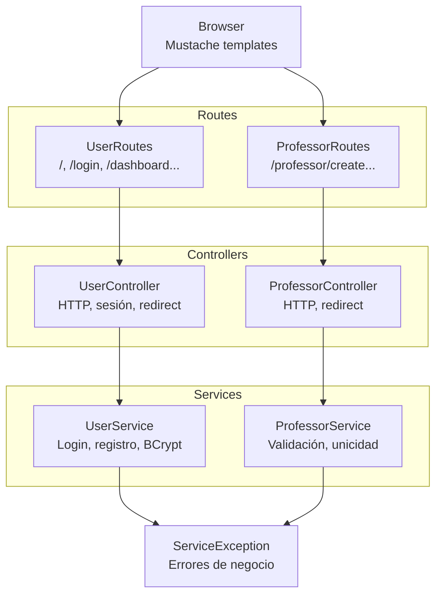
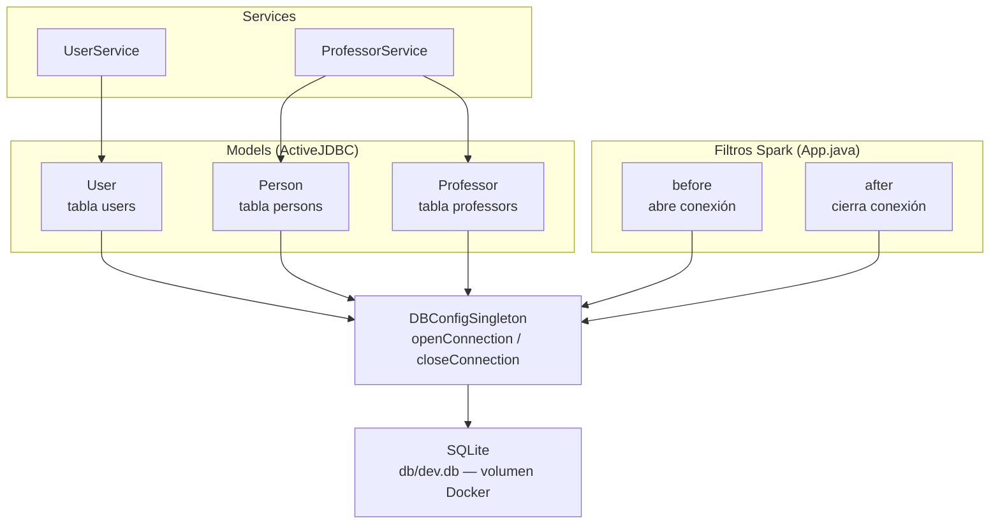

# Arquitectura del sistema universitario

## Capa HTTP y lógica de negocio

```mermaid
flowchart TD
    Browser["Browser\nMustache templates"]

    subgraph ROUTES ["Routes"]
        UR["UserRoutes\n/, /login, /dashboard..."]
        PR["ProfessorRoutes\n/professor/create..."]
    end

    subgraph CONTROLLERS ["Controllers"]
        UC["UserController\nHTTP, sesión, redirect"]
        PC["ProfessorController\nHTTP, redirect"]
    end

    subgraph SERVICES ["Services"]
        US["UserService\nLogin, registro, BCrypt"]
        PS["ProfessorService\nValidación, unicidad"]
    end

    SE["ServiceException\nErrores de negocio"]

    Browser --> UR
    Browser --> PR
    UR --> UC
    PR --> PC
    UC --> US
    PC --> PS
    US --> SE
    PS --> SE
```

## Capa de persistencia

```mermaid
flowchart TD
    subgraph SERVICES ["Services"]
        US["UserService"]
        PS["ProfessorService"]
    end

    subgraph MODELS ["Models (ActiveJDBC)"]
        MU["User\ntabla users"]
        MP["Person\ntabla persons"]
        MPR["Professor\ntabla professors"]
    end

    subgraph FILTERS ["Filtros Spark (App.java)"]
        BF["before\nabre conexión"]
        AF["after\ncierra conexión"]
    end

    DB["DBConfigSingleton\nopenConnection / closeConnection"]
    SQLite["SQLite\ndb/dev.db — volumen Docker"]

    US --> MU
    PS --> MP
    PS --> MPR
    MU --> DB
    MP --> DB
    MPR --> DB
    BF --> DB
    AF --> DB
    DB --> SQLite

```