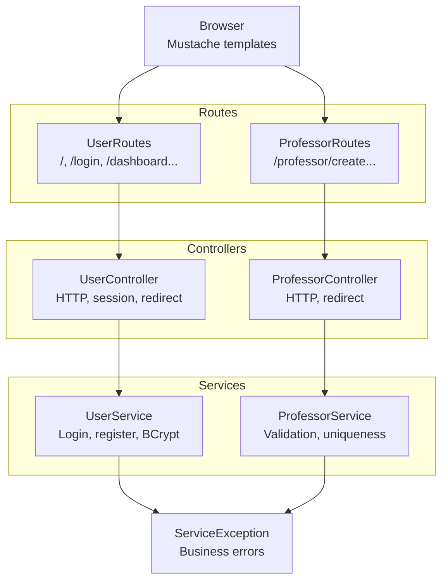
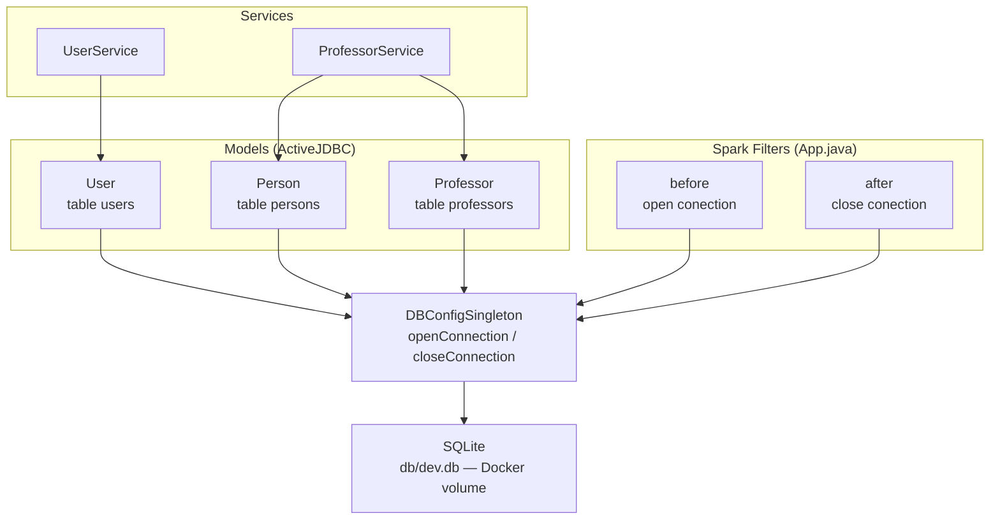

# University System Architecture

## HTTP Layer and Business Logic

```mermaid
flowchart TD
    Browser["Browser\nMustache templates"]

    subgraph ROUTES ["Routes"]
        UR["UserRoutes\n/, /login, /dashboard..."]
        PR["ProfessorRoutes\n/professor/create..."]
    end

    subgraph CONTROLLERS ["Controllers"]
        UC["UserController\nHTTP, session, redirect"]
        PC["ProfessorController\nHTTP, redirect"]
    end

    subgraph SERVICES ["Services"]
        US["UserService\nLogin, register, BCrypt"]
        PS["ProfessorService\nValidation, uniqueness"]
    end

    SE["ServiceException\nBusiness errors"]

    Browser --> UR
    Browser --> PR
    UR --> UC
    PR --> PC
    UC --> US
    PC --> PS
    US --> SE
    PS --> SE
```

## Persistence Layer

```mermaid
flowchart TD
    subgraph SERVICES ["Services"]
        US["UserService"]
        PS["ProfessorService"]
    end

    subgraph MODELS ["Models (ActiveJDBC)"]
        MU["User\ntable users"]
        MP["Person\ntable persons"]
        MPR["Professor\ntable professors"]
    end

    subgraph FILTERS ["Spark Filters (App.java)"]
        BF["before\nopen conection"]
        AF["after\nclose conection"]
    end

    DB["DBConfigSingleton\nopenConnection / closeConnection"]
    SQLite["SQLite\ndb/dev.db — Docker volume"]

    US --> MU
    PS --> MP
    PS --> MPR
    MU --> DB
    MP --> DB
    MPR --> DB
    BF --> DB
    AF --> DB
    DB --> SQLite

```
